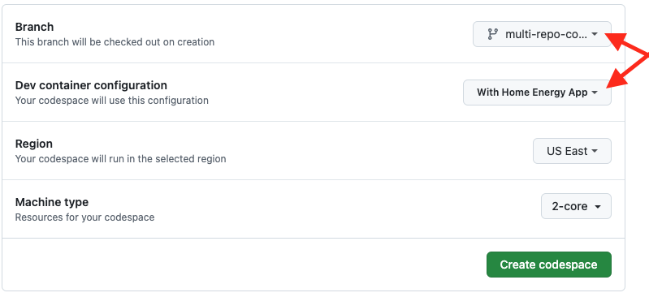

# How to use multi-repo dev container setup

1. Fork both greenbutton and home-energy-analysis-tool.
   - [Fork greenbutton](https://github.com/codeforboston/greenbutton_objects/fork)
   - [Fork home-energy-analysis-tool](https://github.com/codeforboston/home-energy-analysis-tool/fork)


2. To bring the multi-repo branch into the local copy your forked repo.
3.  Make sure to replace `YOUR_GITHUB_USERNAME` with your actual github username.

Set an environment variable containing your GitHub user name.
```
GITHUB_USERNAME=YOUR_GITHUB_USERNAME
```
Create a temporary working directory to contain the files you will need to create.
```
mkdir multi-repo
```
Go into the temporary working directory
```
cd multi-repo
```

The following script will copy a branch from Vlad's repository to your fork of `greenbutton_objects`.  Copy and paste the whole thing and hit enter to run.
```
# Clone the greenbutton_objects git repository into a new sub-directory
git clone "git@github.com:${GITHUB_USERNAME}/greenbutton_objects.git"

# Go into the cloned repository directory
cd greenbutton_objects

# Add a link to the Vladistan fork of the repository
git remote add vlad "https://github.com/vladistan/greenbutton_objects.git"

# Fetch all the branches from all remote links in your repository
git fetch --all

# Check out the multi-repo-container branch
git checkout --track vlad/multi-repo-container

# Push the branch to your fork
git push origin multi-repo-container

# Hop back
cd ..
```
This next script will copy a branch from Vlad's repository to your fork of `home-energy-analysis-tool`.  Again, copy and paste the whole thing and hit enter to run.
```
# Clone the home-energy-analysis-tool into a new sub-directory
git clone git@github.com:${GITHUB_USERNAME}/home-energy-analysis-tool.git

# Go into the cloned repository directory
cd home-energy-analysis-tool

# Add a link from the Vladistan fork of the repository
git remote add vlad "https://github.com/vladistan/home-energy-analysis-tool.git"

# Fetch all the branches from all remote links in your repository
git fetch --all

# Checks out the multi-repo-container branch again
git checkout --track vlad/multi-repo-container

# Push the other the repository, home-energy-analysis-tool, to the multi-repo-container branch
# hence the name multi-repo-container
git push origin multi-repo-container

# Leave the repository sub-directory
cd ..

# Leave the temporary working directory, which you can now delete
cd ..
```

3. Start Github codespace with options make sure to select correct branch `multi-repo-container` and correct configuration 'With Home Energy App' as shown below:



4. Once the codespace starts up and you see a message like the one below, wait for the setup to complete.

```
Finishing up
Running postStartCommand
.devcontainer/post_start.sh
```

5. Once your setup completes and you see that your VSCode extensions button in the toolbar looks like the one below click on it to see if any you have to do any extra actions like reloading a window before you can start working on the code

   
   

# How to reset the branches to Vlad's latest

NOTE: This will overwrite any changes you have in your multi-repo-container branch. If you have made
local changes and did not push them anywhere you will lose them.  To save them create new local branches in green button and home energy analysis tool repos.
Use the commainds below to save your changes, make sure you have all local changes committed before you do this:

```
git checkout multi-repo-container
git checkout -b multi-repo-container-backup
```

Now use the commands below to reset your branches to Vlad's latest, do it in greenbutton repo first:

```
git remote rm vlad || true
git checkout main
git remote add vlad "https://github.com/vladistan/greenbutton_objects.git"
git branch -D multi-repo-container || true
git fetch --all
git checkout -b multi-repo-container
git reset --hard vlad/multi-repo-container
git branch --set-upstream-to=origin/multi-repo-container
git push --force origin multi-repo-container
```

Then do it in home-energy-analysis-tool repo:

```
git remote rm vlad || true
git checkout main
git remote add vlad "https://github.com/vladistan/home-energy-analysis-tool.git"
git branch -D multi-repo-container || true
git fetch --all
git checkout -b multi-repo-container
git reset --hard vlad/multi-repo-container
git branch --set-upstream-to=origin/multi-repo-container
git push --force origin multi-repo-container
```
